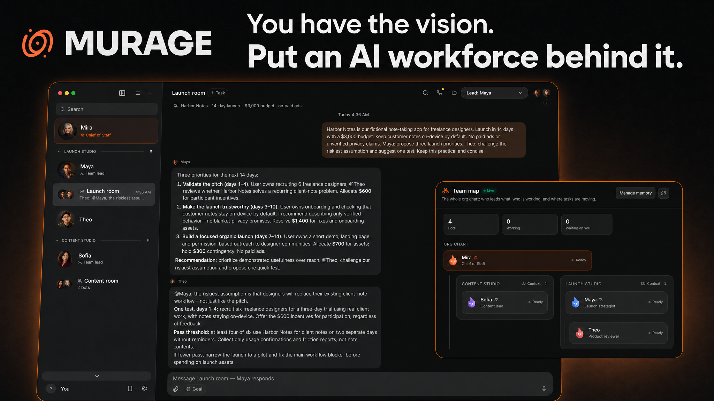
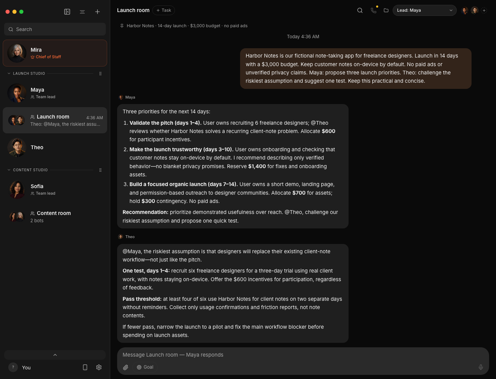
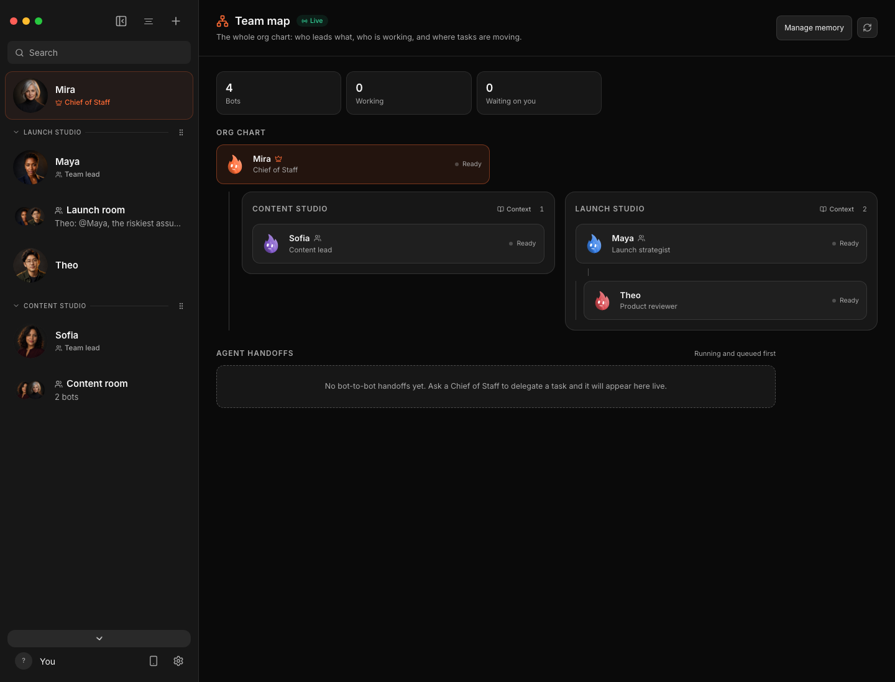
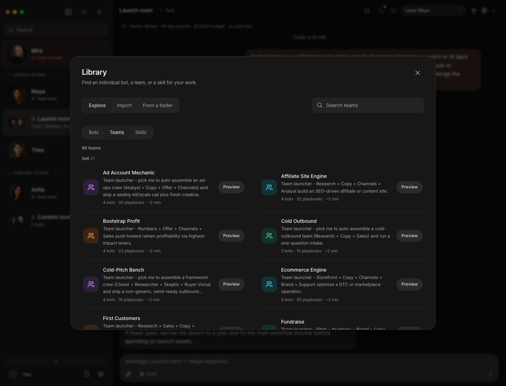
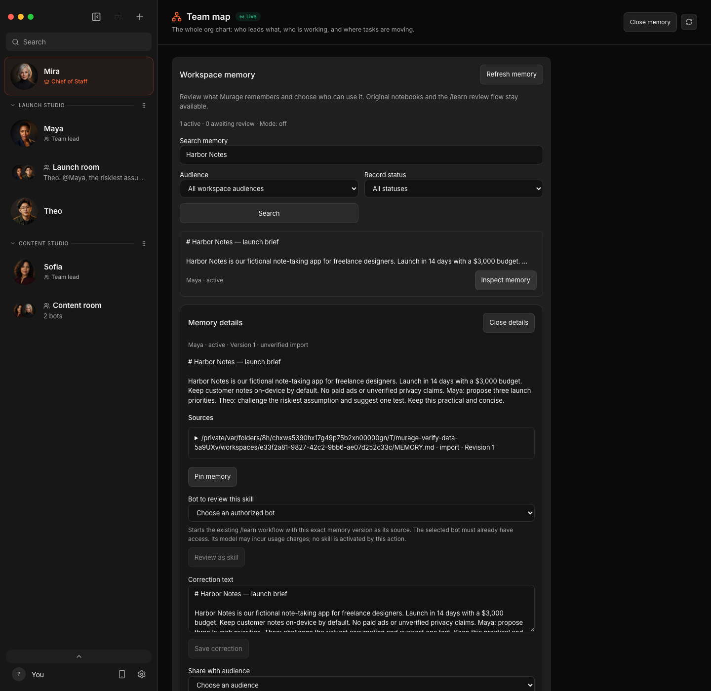
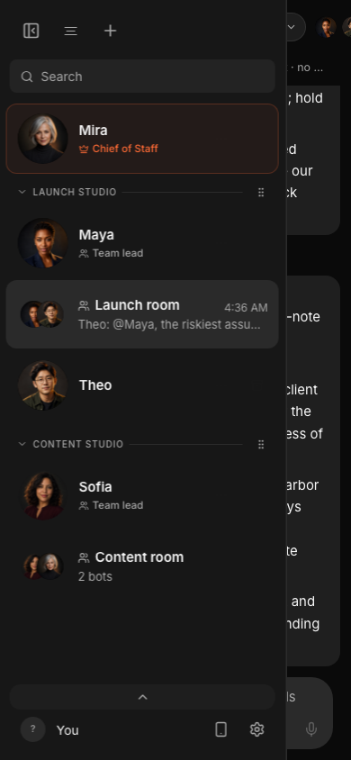

<div align="center">



**You have the vision. Put an AI workforce behind it.**

Brief your AI Chief of Staff. It assembles specialists, coordinates their work, and brings the results back to you—with shared tools, durable memory and you in control.

*For founders, creators and operators with more ideas than hands.*

[Build your first AI team →](#download) · [See it in action](#a-real-brief-a-working-team) · [Web & mobile](#your-workspace-on-the-device-in-your-hand) · [Memory](#memory-that-you-can-inspect-and-control) · [Telegram](#stay-in-the-conversation-from-telegram)

</div>

Start with the outcome: launch a product, research a market, review a codebase or build a content workflow.

Murage brings together a **Chief of Staff, specialist teams, 2,237 skills, connected tools and durable memory** in one workspace. Use a prebuilt team or ask a capable Chief to assemble one for the job. Give agents a browser or computer where supported, follow their work, and make the decisions that need you.

Work in the desktop app, continue through the responsive Web UI or PWA, or message your Chief from Telegram. **Fuigo is included, and multi-vendor choice is built in.**

## Download

**Fuigo is built into the desktop installers for Mac, Windows and Linux.** Install Murage, then connect your provider account or API key. You do not need a JavaScript toolchain or an `npm install` command.

**[Latest release and release notes](https://github.com/FerroxLabs/murage-releases/releases/latest)**

**Windows 0.1.49** is a focused installer and startup hotfix. Fuigo 1.0.8 remains bundled. The reported `-32603` engine errors and exit code `1073807364` remain under investigation.

| Platform | Installer |
|---|---|
| macOS · Apple Silicon | **[Download for Mac](https://github.com/FerroxLabs/murage-releases/releases/latest/download/Murage.dmg)** |
| macOS · Intel | [Download for Intel Mac](https://github.com/FerroxLabs/murage-releases/releases/latest/download/Murage-intel.dmg) |
| Windows · x64 | **[Download for Windows](https://github.com/FerroxLabs/murage-releases/releases/latest/download/Murage-setup.exe)** |
| Ubuntu 24.04 · x64 | **[Download .deb](https://github.com/FerroxLabs/murage-releases/releases/latest/download/Murage-amd64.deb)** · [AppImage](https://github.com/FerroxLabs/murage-releases/releases/latest/download/Murage.AppImage) |

Mac downloads are signed and notarized. Windows downloads are signed. See the release notes for platform verification and known limitations. [Ubuntu checksums](https://github.com/FerroxLabs/murage-releases/releases/latest/download/SHA256SUMS-ubuntu-x64.txt) are available alongside the downloads.

**Fuigo is bundled. Installed desktop builds require no Node.js, npm, pnpm or separate Fuigo installation.** Your selected engine still needs its own provider login or API credentials; model access and provider charges are separate.

If an official desktop build says “Fuigo CLI not found” or asks you to install Fuigo through npm, that is a bundled-engine detection or installation problem, not a normal prerequisite. Report your Murage version, operating system and installer type. Do not include API keys.

## A real brief. A working team.

A 14-day launch. A $3,000 budget. No paid ads. The strategist proposes priorities; the reviewer challenges the assumption that could make the plan fail.



*A saved, real GPT-6 Astra conversation in an isolated demo workspace, now shown in dark mode with custom demo avatars. Harbor Notes and its team identities are fictional.*

## A Chief of Staff for the whole workspace

Give your team a central point of coordination. The **Chief of Staff** sits above team leads and specialists, so you can organize work across several teams instead of managing an undifferentiated list of bots.

In this demo, Mira is Chief of Staff. Maya leads Launch Studio with Theo reviewing the product plan; Sofia leads Content Studio. Each team has its own group conversation. Open **Team map** to see who leads whom and where work is moving.



Custom avatars, named teams and group portraits make that structure easy to recognize in the sidebar. Each agent still has its own role, instructions and model selection.

## Start with a team. Or let your Chief assemble one.

You do not have to invent every role and workflow yourself. Browse **prebuilt teams** for an outcome, inspect their members and playbooks, and choose what to import. Agents—called **Embers**—can also work individually, with their own instructions, model and task history.

With a delegation-compatible engine, your Chief can use the live roster, create useful specialists when you ask for a team, and assign them work. The Chief stays your central point of contact. In 0.1.47, nested Chief-to-lead-to-specialist delegation has a known tool-availability limitation; improvements are in development and are not part of this release.

> “Build a launch team for this product. Have a strategist propose the plan, a reviewer challenge the assumptions, and a writer prepare the copy. Bring me the decisions.”

### 2,237 skills to build on

The shipped skill library spans research, writing, engineering, design, operations and business workflows. Search for the task, find an existing playbook and give the right capabilities to the right agent. Team import previews show what will be added before you accept; credentials and permission grants do not travel inside a team package.



## Give your agents somewhere to work

A plan becomes more useful when the agent can work with the tools and environments the task requires.

| Environment | What it is for |
|---|---|
| **Browser** | Work with web pages through browser tools and, where available, view the interactive browser inside Murage. |
| **This computer** | Use the host's screen and applications after the required platform permissions and explicit setup. |
| **Local VM** | Give an agent a separate local Linux desktop in supported configurations. |
| **Remote / cloud computer** | Connect a supported cloud or user-managed remote desktop environment, separate from your everyday computer. |
| **Off** | Keep desktop access disabled for work that does not need it. |

Choose the destination per bot. Browser, local control, VM and remote access have their own setup requirements; engine support and permissions determine which actions are available. Hosted computers can have separate costs.


## Keep the lessons. Improve the playbook.

A useful process should become something your team can reuse. A correction should become context for the next attempt.

Ask an agent to **`/learn`** a workflow, a source, or what you just worked through. It can distill the steps into a reusable skill—or revise an existing learned skill when you explicitly request it. Murage stages the change for review; **you approve it before it becomes active**.

Combined with managed memory, this gives the team an evolving working playbook: relevant context for the current task, reusable procedures for recurring work, and corrections you can inspect and carry forward. The team can adapt its plan and specialist mix to the workload while permanent skill changes stay under your control.

## Memory that you can inspect and control

**Memory belongs to Murage, independently of the engine chosen for an agent.** It is stored as durable records with source history and searchable indexes. Relevant context is selected for eligible turns; supported integrations also expose deeper memory tools.

- **Recall useful context.** Search by keywords and, after the optional local-model download on supported platforms, by meaning. Bounded context keeps a growing history from becoming one ever-larger prompt.
- **Keep audiences separate.** Bot, conversation, channel, team and project scopes determine what can be recalled. Private notes do not automatically become shared team knowledge.
- **See where a memory came from.** Inspect source excerpts and versions. Review candidates, correct a record, or pin an important constraint.
- **Share deliberately.** Approve knowledge for a different audience instead of silently pooling everything every agent knows.
- **Forget and recover.** Forgetting excludes affected material from future recall. Authoritative memory is included in installation backups; derived indexes can be rebuilt.
- **Bring existing notes forward.** Preview and import existing notebooks or team briefs while preserving the original files.



*Inspect the saved launch brief’s source and audience. This record was deliberately imported from the demo conversation and retains its unverified-import label.*

**In 0.1.47, managed memory starts off.** Open **More → Team map → Manage memory** to choose Capture only or Capture and recall. Local indexing does not require a paid extraction model. Optional model-based extraction is a separate, explicit setting and creates review candidates.

Local storage is not the same as local-only AI processing: recalled context sent to a hosted engine is processed by that provider. Forgetting cannot retract text already sent. Intel Macs use keyword memory in this release; local semantic retrieval is available on Apple Silicon, Windows x64 and Linux x64 after model setup. [Read the memory guide](docs/memory.md).

## Your workspace, on the device in your hand

Start at your desk. Continue from your phone, tablet or another computer. Murage's **Web UI serves the same workspace**, so you can follow conversations and work from a paired browser without installing another desktop copy.

- **Responsive on mobile.** Navigation, conversations and controls adapt to smaller screens and touch input.
- **Installable as a PWA.** On a supported browser with secure HTTPS access, add Murage to your home screen or install it as a standalone web app.
- **Private remote access.** Enable browser access and pair your device over your own Tailscale network. The workspace is not automatically exposed to the public internet.
- **One running workspace.** Agents execute on the host running Murage; your paired device connects to that host. Keep it available when you want to continue elsewhere.

<p align="center"></p>

*The same demo workspace, with its touch-friendly navigation open on a phone-sized screen.*

Desktop-only administration stays on the desktop. The PWA does not turn a phone into an independent agent host, and an offline shell does not keep remote agents working without a connection.

## Stay in the conversation from Telegram

Message your Chief of Staff from a **paired private Telegram chat**. Messages join the Chief's current Murage conversation, so the desktop and Telegram views stay connected to the same work.

For supported ordinary tool requests, the paired owner can use one-time **Allow once / Deny** buttons. Richer proposal reviews stay in Murage; typing “approve” in a message does not grant permission.

Set it up in **Settings → Channels → Telegram** using your own bot token and a pairing code. Keep Murage running and pair again after restarting. Revoke the connection from Settings when you no longer want it active.

| Service | What you can do today |
|---|---|
| **Telegram** | Continue the Chief’s conversation and answer supported one-time approval requests from a paired private chat. |
| **Slack** | Connect Slack through Composio so capable agents can read channels and post updates, subject to the connected account and permissions. Inbound Slack control is not yet shipped. |
| **Discord** | Control-channel support is coming soon. |

Telegram group routing and additional inbound messaging channels remain future work. [Telegram setup and boundaries](docs/telegram.md).

## Fuigo built in. Multi-vendor by design.

**Fuigo is Murage’s bundled agent harness**, with its tool and permission integration included in the shipped desktop build. You can start with it without separately installing Fuigo. The release checks cover the bundled executable and its integration; provider login and model access remain yours.

Multi-vendor choice is part of the product, not an add-on. Use Fuigo, installed engines such as **Claude Code** and **Codex**, custom ACP agents, or compatible API endpoints. Choose an engine and model per agent, mix them in a team, and keep Murage-owned conversations and memory around that work. Each engine retains its supported capabilities and permission requirements.

## Connect the tools your team uses

Connect tools through **Composio** or your own **MCP servers**. Search can use an engine's native capability, Murage's free backup search mode, or an explicitly selected Tavily, Exa or Firecrawl account. Browser and computer tools are available in supported configurations with their required permissions.

Murage also includes a local MCP server for other clients to list the team, send work, read bounded transcripts and wait for results. This coordination interface does not grant those clients permission to approve actions or change credentials.

**Capabilities depend on the engine and platform.** A text-only compatible endpoint can discuss and write without being able to operate tools. Connecting an account does not bypass approvals, and memory does not grant filesystem or computer access.

## Start with one useful task

1. **Install and open Murage.** On macOS, move it to Applications. On Windows, run the installer. On Ubuntu, use `sudo apt install ./Murage-amd64.deb`, or make the AppImage executable and open it.
2. **Set up an engine.** Open Settings → Engines and use the login or credentials it requires.
3. **Create an Ember or review a team.** Give it a clear role and choose its model.
4. **Send a concrete brief.** Include the outcome, constraints and what needs your approval. Add teammates to a channel when another perspective helps.
5. **Make the workspace yours.** Enable the memory mode and audiences you want. Pair the Web UI/PWA for another device, connect Telegram for messaging, or give capable agents access to Slack and other tools.

## Before you choose a setup

| Area | Current boundary |
|---|---|
| Windows browser | See [release notes](https://github.com/FerroxLabs/murage-releases/releases/latest) for Windows verification and known limitations. |
| Ubuntu desktop control | The app runs on GNOME Xorg and Wayland; local computer control is restricted to Xorg. Linux dictation and ARM64 installers are unavailable. |
| Intel Mac memory | Keyword retrieval and owner controls; no local semantic runtime in 0.1.47. |
| Background work | Murage's host must remain available for routines and Telegram. This release is not an always-on hosted service. |
| Memory scale | Verified for ordinary interactive use. Sustained high-throughput ingestion and continuous-search saturation tuning remain deferred. |
| Cross-device memory | No automatic memory synchronization between separate installations or profiles. |

## Build from source

The [application source repository](https://github.com/FerroxLabs/murage) is currently private. Developers with access need Node.js 24+ and pnpm 10.33.0.

```sh
git clone https://github.com/FerroxLabs/murage.git
cd murage
pnpm install --frozen-lockfile
```

Run `pnpm dev:server` and `pnpm dev` in separate terminals, then `pnpm dev:desktop` for the Electron shell. Use `pnpm typecheck` and `pnpm test` for validation. Native installer commands are `pnpm package:mac`, `pnpm package:win` and `pnpm package:linux`; packaging is separate from publication.

Further guides: [custom engines](docs/custom-engines.md), [custom MCP servers](docs/custom-mcp-servers.md), [Murage MCP server](docs/mcp-server.md), [connected apps](docs/composio.md), [Ubuntu](docs/linux-desktop.md), [recovery](docs/verification/installation-recovery.md), and [releasing](docs/releasing.md).

## Credits and license

Murage is developed by **Ferrox Labs** and is a fork of [OpenMausBot](https://github.com/milind-soni/OpenMausBot), created by Milind Soni and its contributors. Murage is independently maintained and is not affiliated with or endorsed by the upstream project.

Licensed under Apache 2.0. See [LICENSE](LICENSE) and [NOTICE](NOTICE). Bundled third-party components retain their own licenses and attribution.
