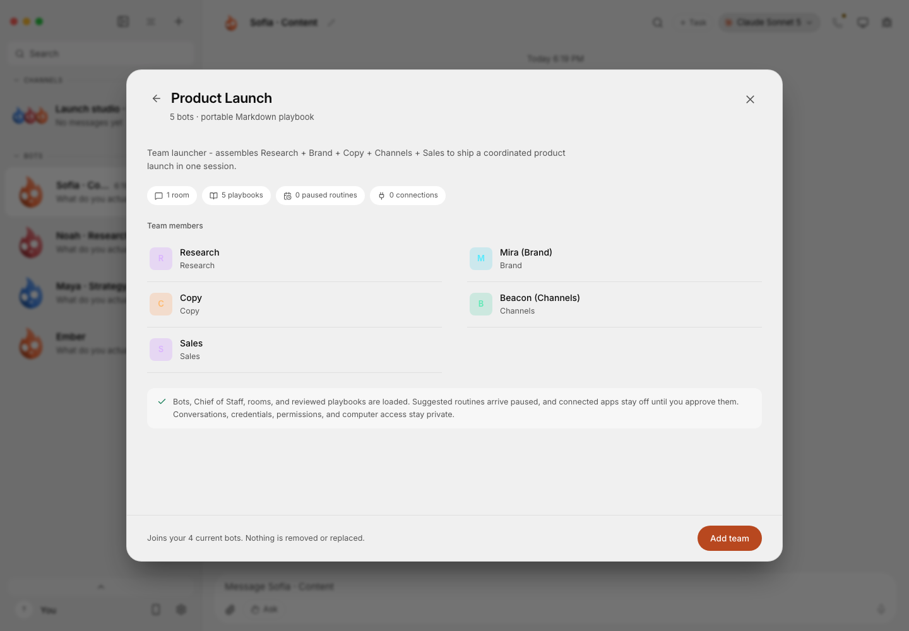

<div align="center">


**Run a team of AI agents from one desktop app.**

[Download](#download) · [What it does](#what-it-does) · [Build from source](#build-from-source)

</div>

Murage brings your agents, conversations, tasks and approvals into one workspace. Give each agent (an **Ember**) a role and an engine, work with it directly, or bring several agents into a shared channel.

## Download

**[Murage 0.1.46: release notes and versioned downloads](https://github.com/FerroxLabs/murage-releases/releases/tag/v0.1.46)**

These direct links always download the latest public release:

| Platform | Download |
|---|---|
| macOS Apple Silicon | [Murage.dmg](https://github.com/FerroxLabs/murage-releases/releases/latest/download/Murage.dmg) |
| macOS Intel | [Murage-intel.dmg](https://github.com/FerroxLabs/murage-releases/releases/latest/download/Murage-intel.dmg) |
| Windows x64 | [Murage-setup.exe](https://github.com/FerroxLabs/murage-releases/releases/latest/download/Murage-setup.exe) |
| Ubuntu 24.04 x64 | [Murage-amd64.deb](https://github.com/FerroxLabs/murage-releases/releases/latest/download/Murage-amd64.deb) |
| Ubuntu 24.04 x64, portable | [Murage.AppImage](https://github.com/FerroxLabs/murage-releases/releases/latest/download/Murage.AppImage) |

macOS packages are signed and notarized. The Windows installer, application and bundled Fuigo executable are signed. [Ubuntu checksums](https://github.com/FerroxLabs/murage-releases/releases/latest/download/SHA256SUMS-ubuntu-x64.txt) are also available.

### Get started

1. Install the download for your platform. On macOS, move Murage to Applications; on Windows, run the installer. On Ubuntu, use `sudo apt install ./Murage-amd64.deb`, or make the AppImage executable and open it.
2. Open Murage and configure an engine in Settings. **Fuigo 1.0.4 is bundled**; other CLI engines need their own installation and login.
3. Choose an engine and model for your Ember, then start a conversation. Review permission requests before approving actions.

**Installed desktop builds do not require Node.js or pnpm.** Model access is separate: use the login or API credentials required by your chosen provider. Provider charges and subscription eligibility still apply.

## What it does

- **Agents with distinct roles.** Give each Ember its own instructions, model and task history. Adapters include Fuigo, Claude Code, Codex and other configured CLIs; [custom ACP agents and compatible API endpoints](docs/custom-engines.md) can be added too.
- **Shared channels and delegation.** Bring agents into a conversation, assign work and follow their replies and activity.
- **Routines and reviewed actions.** Schedule recurring work and handle approval cards in chat. The host running the agents must remain available for scheduled work.
- **Connected tools.** Use configured Composio connections or [your own MCP servers](docs/custom-mcp-servers.md). Availability and sign-in requirements depend on your setup; custom MCP tools are not automatically pre-approved.
- **Browser and computer tools.** Supported configurations can give an agent a browser, local computer or separate machine, with explicit controls and platform-specific prerequisites. See [computer-use integration](docs/computer-use-integration.md) and [private VPS setup](docs/byo-vps.md).

Fuigo retains its intended global and project configuration. Murage does not replace the provider's own account or make every engine support the same tools.

## A look inside

Browse included teams and skills in the current app:


Review a Product Launch team before adding it. These screenshots use fictional demo data; no private conversations or live business results are shown.



## Current limits

- **Windows:** the built-in browser remains disabled because of an upstream Electron sandbox issue.
- **Ubuntu:** the desktop app supports GNOME Xorg and Wayland, but local computer control is currently restricted to Xorg. Linux dictation and ARM64 packages are unavailable. See [Ubuntu Desktop](docs/linux-desktop.md).
- **External channels:** messaging channels are not yet a verified end-to-end Murage feature; Slack, WhatsApp and similar services cannot be assumed supported because an underlying engine supports them. Fuigo's scoped Murage tool discovery, real calls, approval/cancellation and inherited configuration have been verified separately.
- Broader cloud onboarding and complete installation-recovery acceptance remain ongoing work. The retired native iOS companion was never released.

## Build from source

For developers with access to the [source repository](https://github.com/FerroxLabs/murage), which is currently private.

**Requirements:** Node.js 24+ and pnpm 10.33.0, as declared in `package.json`.

```sh
git clone https://github.com/FerroxLabs/murage.git
cd murage
pnpm install --frozen-lockfile
```

Start the API and UI in separate terminals:

```sh
pnpm dev:server   # API: http://127.0.0.1:8799
```

```sh
pnpm dev          # UI: http://127.0.0.1:5199
```

With both running, `pnpm dev:desktop` opens the Electron shell. `MURAGE_PORT` and `MURAGE_UI_PORT` override the default ports.

Validate changes with `pnpm typecheck` and `pnpm test`. Build installers on the corresponding native platform:

```sh
pnpm package:mac
pnpm package:win
pnpm package:linux
```

Packaging downloads pinned helpers and requires the platform's build tools. Public signing and notarization require separate release credentials; packaging does not publish a release. See [releasing](docs/releasing.md) and [verification](docs/verification/README.md).

## Configuration and help

Workspace settings live in `~/.murage/config.json`; provider CLIs also retain their own configuration. Use desktop settings for credentials rather than placing secrets in shared configuration or bug reports.

- [Custom engines](docs/custom-engines.md)
- [Custom MCP servers](docs/custom-mcp-servers.md)
- [Connected apps](docs/composio.md)
- [Ubuntu Desktop](docs/linux-desktop.md)
- [Private VPS](docs/byo-vps.md)

## Credits and license

Murage is developed by **Ferrox Labs** and is a fork of [OpenMausBot](https://github.com/milind-soni/OpenMausBot), created by Milind Soni and its contributors. Murage is independently maintained and is not affiliated with or endorsed by the upstream project.

Licensed under Apache 2.0. See [LICENSE](LICENSE) and [NOTICE](NOTICE). Bundled third-party components retain their own licenses and attribution.
